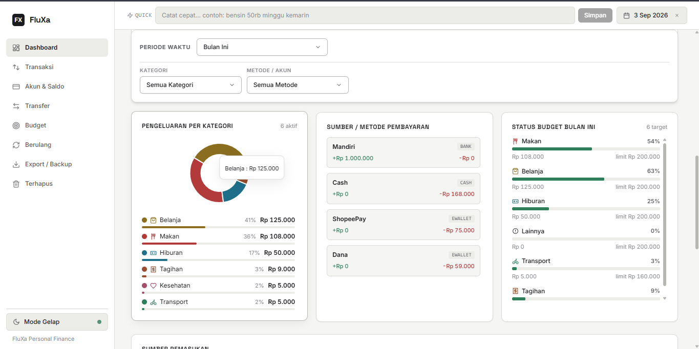

<div align="center">


### Catat, pantau, dan kendalikan keuangan pribadimu — cukup lewat chat.

FluXa adalah aplikasi pencatatan keuangan pribadi dengan dua pintu masuk: **web app** yang responsif dan **bot Telegram**. Tanpa spreadsheet berantakan, tanpa biaya LLM.

<p>
  
  
  
  
  
  
</p>

<p>
  
  
  
</p>

<p>
  <a href="#tentang-fluxa"><b>Tentang</b></a> ·
  <a href="#fitur-unggulan"><b>Fitur Unggulan</b></a> ·
  <a href="#bot-telegram"><b>Bot Telegram</b></a> ·
  <a href="#quick-start"><b>Quick Start</b></a> ·
  <a href="#fitur-lengkap"><b>Fitur Lengkap</b></a> ·
  <a href="#cara-menggunakan"><b>Cara Pakai</b></a> ·
  <a href="#api"><b>API</b></a> ·
  <a href="#roadmap"><b>Roadmap</b></a>
</p>

</div>

<br>

> [!NOTE]
> Bahasa yang digunakan pada FluXa dan dokumentasi ini adalah Bahasa Indonesia, disesuaikan dengan target pengguna utama.

<br>

## Tentang FluXa

Data tersimpan di PostgreSQL, backend menyediakan REST API, dan frontend menampilkan ringkasan finansial dalam dashboard yang bersih — desain minimalis hitam-putih beraksen hijau & merah untuk pemasukan/pengeluaran.

Inti dari FluXa adalah **Quick Input**: tulis transaksi seperti sedang mengobrol, dan sistem mem-parsing-nya menjadi data terstruktur — di web maupun di Telegram, tanpa biaya LLM sama sekali.

```text
Input:   Nasi goreng 15rb mandiri kemarin
Output:  Rp 15.000 · Kategori: Makanan · Metode: Mandiri · Tanggal: kemarin (WITA) · Confidence: high
```

Semua nominal, metode pembayaran, kategori, tanggal, dan keterangan dibaca otomatis oleh **parser rule-based**, dan hasilnya selalu bisa ditinjau sebelum disimpan. Transaksi dengan confidence rendah otomatis ditandai `review`.

<br>

## Tampilan

<div align="center">

<p><i>Dashboard — pengeluaran per kategori, saldo per akun, dan status budget bulanan</i></p>
</div>

<!-- Tambahkan screenshot halaman Transaksi dan bot Telegram juga kalau ada, biar makin lengkap. -->

## Fitur Unggulan

| # | Fitur | Keunggulan |
|:-:|:--|:--|
| 1 | **Bot Telegram** | Catat transaksi langsung dari chat, ringkasan & saldo satu ketukan, undo/edit, backup ke chat — berjalan lokal via long polling, tanpa server publik. |
| 2 | **Quick Input otomatis** | Auto-parse saat mengetik (debounce 350ms) di web, cukup satu tombol **Simpan**. Mendukung angka `15rb`, `1.5jt`, `15.000`, `15k` dan frasa tanggal seperti `kemarin`, `senin lalu`, `2 minggu lalu`. |
| 3 | **Dashboard bulanan** | Ringkasan total, rasio tabungan, tren, breakdown kategori, saldo per akun, dan progress budget — dengan navigasi antar bulan `‹ ›`. |
| 4 | **Manajemen akun & saldo** | Saldo awal, saldo berjalan per akun, transfer antar cash/bank/e-wallet. |
| 5 | **Transaksi berulang** | Template tagihan/pemasukan rutin dengan interval fleksibel, progress pencapaian, dan pengingat jatuh tempo di dashboard. |
| 6 | **Backup otomatis** | Backup JSON lengkap terjadwal (default tiap 24 jam, retensi 14 file), plus backup on-demand lewat bot Telegram. |
| 7 | **Zona waktu WITA** | Semantik hari & waktu konsisten dalam `Asia/Makassar` (UTC+8), dari parser hingga dashboard dan bot. |

<br>

## Bot Telegram

> Fitur andalan FluXa. Semua interaksi lewat chat — tanpa membuka browser.

Berjalan sebagai **local bot** menggunakan Telegram **long polling** (native `fetch`, tanpa dependency eksternal) — cukup jalan di mesin yang sama dengan server, **tidak perlu webhook, HTTPS, atau server publik**.

### Perintah

| Perintah | Fungsi |
|:--|:--|
| `/ringkasan` atau `/ringkasan hari\|minggu\|bulan\|semua` | Ringkasan keuangan (default: bulan berjalan) |
| `/saldo` | Saldo setiap akun |
| `/undo` | Batalkan transaksi Telegram terakhir |
| `/edit` | Edit transaksi Telegram terakhir |
| `/backup` | Kirim file backup JSON lengkap ke chat |
| `/id` | Tampilkan chat ID kamu |
| `/batal` | Batalkan proses yang sedang berjalan |
| `/help` atau `/start` | Tampilkan bantuan & panel menu |

### Panel Menu

```text
[ Makan ]          [ Transportasi ]
[ Belanja ]        [ Tagihan ]
[ Gaji ]           [ Lainnya ]
[ Ringkasan ]      [ Saldo akun ]
[ Undo terakhir ]  [ Edit terakhir ]
[ Backup ]         [ Bantuan ]
```

Alur **pencatatan terpandu** dibimbing langkah demi langkah lewat tombol:

1. Pilih **kategori** (Makan, Transportasi, Belanja, Tagihan, Gaji, Lainnya)
2. Pilih **nominal** (tombol cepat `10rb` / `25rb` / `100rb`) atau ketik custom (`35rb`, `1.5jt`)
3. Pilih **metode pembayaran** (dari database, dengan alias)
4. Pilih **tanggal** (`Hari ini`, `Kemarin`, atau `YYYY-MM-DD`)
5. Ketik **keterangan** (opsional)
6. Tinjau preview, tekan **Simpan** atau **Batal**

Atau langsung **ketik kalimat bebas**:

```text
Input:  wifi 300rb mandiri
Output:
  Pengeluaran
  Rp 300.000 · Kategori: Tagihan · Metode: Mandiri
  Keterangan: wifi · Confidence: high
  [ Simpan ] [ Batal ]
```

### Keamanan & Isolasi

- Hanya **chat terdaftar** (`TELEGRAM_ALLOWED_CHAT_IDS`) yang boleh menggunakan bot.
- Transaksi dan state bot di-scope per chat — `/undo` dan `/edit` hanya menyentuh transaksi dari chat tersebut.
- Bot tidak pernah mengirim data ke pihak lain; backup dikirim hanya ke chat terdaftar.

<br>

## Teknologi

| Layer | Teknologi |
|:--|:--|
| **Frontend** | React 19 · TypeScript · Vite |
| **Styling** | Tailwind CSS 4 · CSS Variables |
| **Data Fetching** | TanStack Query |
| **Charts** | Recharts |
| **Backend** | Node.js · Express 5 · TypeScript |
| **Bot Telegram** | Long polling native (`fetch`) — tanpa dependency eksternal |
| **Database** | PostgreSQL |
| **Migration** | node-pg-migrate |
| **Validation** | Zod |
| **Test** | `node:test` + `tsx` |
| **Monorepo** | npm workspaces |

<br>

## Arsitektur

```text
Telegram ──────────────────────────────┐
  │ long polling /api                 │
  └─────────────────────────────┐      │
                                ▼      ▼
Browser ── React + Vite + TanStack Query ── /api proxy ──┐
                                                        ▼
                                              Express REST API
                                                        │
                          ┌─────────────┬───────────────┼───────────────┐
                          ▼             ▼               ▼               ▼
                     Controllers   Repositories   Rule-based      PostgreSQL
                                                    parser
                          │             │               │
                          └─────────────┴───────┬───────┘
                                                ▼
                                       Backups (JSON, terjadwal
                                       + on-demand via Telegram)
```

> [!TIP]
> Semua tabel inti sudah memiliki kolom `user_id` sejak awal, jadi auth dan multi-user bisa ditambahkan nanti tanpa mengubah struktur utama database.

<br>

## Quick Start

### Prasyarat

| Tool | Versi minimum |
|:--|:--|
| Node.js | 22+ |
| npm | 10+ |
| PostgreSQL | 14+ |

### 1. Clone & Install

```bash
git clone https://github.com/FlucLight/personal-finance-tracker.git
cd personal-finance-tracker
npm install
```

### 2. Environment

<details>
<summary><b>Windows (PowerShell)</b></summary>

```powershell
Copy-Item .env.example .env
```
</details>

<details>
<summary><b>macOS / Linux</b></summary>

```bash
cp .env.example .env
```
</details>

Isi `.env`:

```env
PORT=5000
DB_USER=postgres
DB_PASSWORD=password-postgres-kamu
DB_HOST=localhost
DB_PORT=5432
DB_NAME=financial_management

# Bot Telegram (opsional, untuk fitur bot)
TELEGRAM_BOT_TOKEN=
TELEGRAM_ALLOWED_CHAT_IDS=

# Backup otomatis
BACKUP_INTERVAL_HOURS=24
BACKUP_RETENTION_COUNT=14
```

### 3. Setup Database

```bash
npm run db:setup   # membuat database jika belum ada
npm run migrate    # membuat tabel & data default
```

### 4. Jalankan Development Server

Butuh dua terminal aktif dari root project:

```bash
# Terminal 1 — backend (REST API + backup + bot Telegram)
npm run dev

# Terminal 2 — frontend
npm run dev:client
```

| Service | URL |
|:--|:--|
| Frontend | `http://localhost:5173` |
| Backend | `http://localhost:5000` |
| Health check | `GET http://localhost:5000/health` |

> [!WARNING]
> Menjalankan `npm run dev:client` tanpa backend akan membuat semua permintaan `/api/*` gagal (koneksi ditolak). Kedua terminal harus aktif.

### 5. Aktifkan Bot Telegram

1. Buat bot lewat [@BotFather](https://t.me/BotFather) dan salin token ke `TELEGRAM_BOT_TOKEN`.
2. Jalankan server tanpa `TELEGRAM_ALLOWED_CHAT_IDS` — bot masuk **mode setup**: balas pesan apa pun dengan chat ID kamu, atau kirim `/id`.
3. Isi `TELEGRAM_ALLOWED_CHAT_IDS=123456789` (pisahkan beberapa ID dengan koma), lalu restart server.
4. Buka chat bot, tekan **Start** atau `/start` — panel menu muncul.

```text
[telegram] Mode setup: kirim pesan untuk mendapatkan chat ID
[telegram] Polling aktif untuk @FluXaFinanceBot
```

<br>

## Fitur Lengkap

<table>
<tr>
<td width="50%" valign="top">

**Pencatatan**
- CRUD pemasukan dan pengeluaran
- Soft delete, hapus massal (checkbox) + Undo via toast
- Restore transaksi dari "Terhapus Baru-baru ini"
- Backdating via frasa tanggal
- Format mata uang Rupiah (angka tabular)
- Kategori & payment method dari database, dengan alias

**Quick Input**
- Parser rule-based murni — tanpa biaya LLM
- Auto-parse saat mengetik (debounce 350ms)
- Nominal: `15000`, `15.000`, `15rb`, `15 ribu`, `15k`, `1.5jt`
- Frasa tanggal: `hari ini`, `kemarin`, `senin lalu`, `2 minggu yang lalu`, dll
- Confidence `high` / `low`; transaksi tidak yakin ditandai `review`

**Dashboard**
- Total pemasukan, pengeluaran, saldo bersih & rasio tabungan
- Navigasi bulan `‹ ›` + "Kembali ke bulan ini"
- Tren, breakdown kategori, saldo per akun, progress budget
- Transaksi terbaru & pengingat transaksi rutin
- Filter periode preset & kustom

</td>
<td width="50%" valign="top">

**Pengelolaan Dana**
- Transfer antar cash, bank, e-wallet — tanpa memengaruhi total saldo
- Saldo awal & saldo berjalan per akun
- Budget bulanan per kategori dengan progress bar
- Transaksi berulang: interval harian/mingguan/bulanan, target & progress
- Auto-generate transaksi rutin saat server aktif

**Backup & Import**
- Export transaksi ke CSV
- Backup otomatis berkala (JSON) — interval & retensi via env
- Import JSON (v2): kategori, payment method, saldo, transfer, transaksi berulang, dengan pencegahan duplikasi ID
- Backup on-demand dari bot Telegram (`/backup`)

**Tampilan**
- Mode Light & Dark
- Custom modal, toast (dengan aksi Undo), dropdown, calendar picker
- Layout responsif — kartu list di mobile, tabel penuh di desktop
- Sidebar desktop → drawer di layar kecil

**Rekayasa**
- Monorepo npm workspaces: `client` / `server` / `shared`
- REST API divalidasi Zod, repository pattern
- Code-splitting dengan `React.lazy`
- Test parser & utilitas (`node:test` + `tsx`)

</td>
</tr>
</table>

<br>

## Cara Menggunakan

<details>
<summary><b>Bot Telegram</b></summary>
<br>

**Catat cepat:** ketik langsung, misalnya `Salon 120rb dana kemarin` → cek preview → **Simpan**.

**Catat terpandu:** ketik `/start` → pilih kategori di panel menu → ikuti alur tombol.

**Cek kondisi keuangan:** `/ringkasan bulan`, `/ringkasan semua`, atau tap **Ringkasan**.

**Cek saldo per akun:** `/saldo` atau tap **Saldo akun**.

**Koreksi kesalahan:** `/undo` untuk membatalkan transaksi terakhir, `/edit` untuk mengubahnya.

**Backup:** `/backup` — file JSON dikirim ke chat kamu.

</details>

<details>
<summary><b>Dashboard</b></summary>
<br>

1. Buka menu **Dashboard**.
2. Gunakan tombol `‹ ›` untuk berpindah bulan, atau preset periode (Hari Ini, 3 Hari, 7 Hari, Bulan Ini, dst).
3. Gunakan filter kategori dan metode pembayaran bila diperlukan.
4. Pilih **Kustom** untuk menentukan tanggal mulai dan selesai sendiri.
5. Perhatikan pengingat transaksi rutin yang jatuh tempo.

</details>

<details>
<summary><b>Quick Input</b></summary>
<br>

1. Ketik transaksi pada kolom Quick di **Dashboard** atau **Transaksi**.
2. Hasil parsing tampil otomatis (debounce 350ms).
3. Klik **Simpan**.
4. Jika hasil kurang yakin, cek transaksi bertanda `review`.

**Contoh:**
```text
Kopi 18rb dana
Bensin 100k cash
Gaji 5jt mandiri
Listrik 250rb bca kemarin
Internet 300rb mandiri 2 minggu yang lalu
```

</details>

<details>
<summary><b>Transaksi</b></summary>
<br>

1. Buka menu **Transaksi** — daftar kartu (mobile) / tabel (desktop).
2. Klik **Catat Transaksi** untuk input manual.
3. Gunakan filter: periode, kategori, tipe, metode, dan kata kunci.
4. Atur jumlah item per halaman (5/10/20/50/Semua) dan navigasi halaman.
5. Tandai checkbox untuk hapus massal, manfaatkan **Undo** pada toast bila salah.

</details>

<details>
<summary><b>Akun & Saldo</b></summary>
<br>

1. Buka menu **Akun** untuk menambah/mengelola payment method.
2. Atur saldo awal — saldo berjalan dihitung otomatis dari transaksi.
3. Pantau saldo setiap akun di Dashboard dan via bot Telegram (`/saldo`).

</details>

<details>
<summary><b>Transfer Dana</b></summary>
<br>

Gunakan menu **Transfer** untuk memindahkan dana antar akun. Transfer tidak menambah pemasukan dan tidak mengurangi pengeluaran pada dashboard — hanya menggeser saldo antar akun.

</details>

<details>
<summary><b>Budget</b></summary>
<br>

1. Buka menu **Budget** → **Set Budget Kategori**.
2. Pilih kategori pengeluaran dan nominal batas bulanan.
3. Pantau progress bar pemakaian.

| Progress | Status |
|:--|:--|
| < 80% | Aman |
| 80% – 99% | Mendekati limit |
| ≥ 100% | Melebihi limit |

</details>

<details>
<summary><b>Transaksi Berulang</b></summary>
<br>

1. Buka menu **Berulang**.
2. Buat template tagihan/pemasukan rutin (interval harian/mingguan/bulanan, tanggal 1–28).
3. Pantau progress dan badge jatuh tempo di dashboard.
4. Aktifkan/nonaktifkan template sesuai kebutuhan.

</details>

<details>
<summary><b>Export & Backup</b></summary>
<br>

Buka menu **Export / Backup**:

- Download **CSV** untuk daftar transaksi aktif.
- Download **JSON** (v2) untuk backup menyeluruh.
- Pilih **File JSON Backup** untuk memulihkan data (duplikasi ID dicegah).

Backup juga berjalan otomatis sesuai `BACKUP_INTERVAL_HOURS` (default 24 jam) dengan retensi `BACKUP_RETENTION_COUNT` (default 14 file) di `server/backups/`.

</details>

<details>
<summary><b>Terhapus Baru-baru Ini</b></summary>
<br>

1. Buka menu **Terhapus**.
2. Lihat transaksi yang dihapus (soft delete).
3. Klik **Pulihkan** untuk mengembalikan transaksi beserta nominalnya.

</details>

<br>

## API

Base URL development: `http://localhost:5000/api`

<details>
<summary><b>Transactions</b></summary>

```text
GET    /transactions
POST   /transactions
GET    /transactions/:id
PATCH  /transactions/:id
DELETE /transactions/:id
POST   /transactions/:id/restore
POST   /transactions/parse
POST   /transactions/quick
```

Filter tersedia: `from` · `to` · `category_id` · `type` · `payment_method_id` · `deleted` · `q` · `page` · `limit` · `sort_by` · `sort_dir`

</details>

<details>
<summary><b>Categories</b></summary>

```text
GET    /categories
POST   /categories
GET    /categories/:id
PATCH  /categories/:id
DELETE /categories/:id
```

Gunakan `GET /categories?type=expense` atau `GET /categories?type=income` untuk memfilter tipe kategori.

</details>

<details>
<summary><b>Payment Methods</b></summary>

```text
GET    /payment-methods
POST   /payment-methods
GET    /payment-methods/:id
PATCH  /payment-methods/:id
DELETE /payment-methods/:id
```

Mendukung `type` (atau `account_type`), alias, dan saldo awal (`initial_balance`).

</details>

<details>
<summary><b>Ringkasan</b></summary>

```text
GET    /summary/totals?from=...&to=...
GET    /summary/balances
```

</details>

<details>
<summary><b>Dana & Budget</b></summary>

```text
GET    /transfers
POST   /transfers
DELETE /transfers/:id

GET    /budgets
POST   /budgets
PATCH  /budgets/:id
DELETE /budgets/:id
```

</details>

<details>
<summary><b>Transaksi Berulang</b></summary>

```text
GET    /recurring-transactions
POST   /recurring-transactions
PATCH  /recurring-transactions/:id
DELETE /recurring-transactions/:id
POST   /recurring-transactions/trigger
```

</details>

<details>
<summary><b>Export & Import</b></summary>

```text
GET    /export/csv
GET    /export/json
POST   /export/json
```

</details>

<br>

## Struktur Project

```text
.
├─ client/                     # Frontend (React + Vite)
│  ├─ src/
│  │  ├─ components/           # QuickInput, FilterBar, Pagination, Toast, ErrorBoundary, dll
│  │  ├─ pages/                # Dashboard, Transaksi, Akun, Budget, Berulang, Transfer, dll
│  │  ├─ api.ts                # Klien API (TanStack Query)
│  │  ├─ App.tsx               # Routing + code-splitting
│  │  ├─ utils.test.ts         # Test utilitas
│  │  └─ utils.ts              # Format Rupiah, WITA, dll
│  └─ package.json
├─ server/                     # Backend (Express 5)
│  ├─ migrations/              # node-pg-migrate
│  ├─ scripts/                 # setup-db, migrate
│  ├─ backups/                 # File backup otomatis
│  └─ src/
│     ├─ config/               # env, db (PostgreSQL)
│     ├─ controllers/          # transactions, summary, export, parser, dll
│     ├─ middleware/
│     ├─ parser/               # Rule-based parser + deteksi frasa tanggal
│     ├─ repositories/         # Lapisan akses data
│     ├─ routes/               # REST API
│     ├─ services/             # backup otomatis
│     ├─ telegram/             # Bot Telegram (long polling)
│     └─ index.ts              # Entry point server + starter bot
├─ shared/
│  └─ src/index.ts             # Tipe & konstanta bersama
├─ .env.example
└─ README.md
```

<br>

## Perintah Development

| Perintah | Fungsi |
|:--|:--|
| `npm run dev` | Jalankan backend: REST API + bot Telegram + backup otomatis |
| `npm run dev:client` | Jalankan frontend (Vite) |
| `npm run db:setup` | Buat database jika belum ada |
| `npm run migrate` | Jalankan migration |
| `npm run migrate:down` | Batalkan migration terakhir (dev only) |
| `npm run typecheck` | Typecheck server & shared |
| `npm run lint --workspace client` | Lint frontend |
| `npm run build --workspace client` | Build frontend |
| `npm run test:parser` | Self-check parser server |
| `npm run test:utils` | Test utilitas frontend |

> [!WARNING]
> Jangan menjalankan `migrate:down` pada production tanpa backup.

<br>

## Roadmap

- [ ] Login dan multi-user (kolom `user_id` sudah siap)
- [ ] Halaman pengelolaan kategori dan payment method yang lebih lengkap
- [ ] Export PDF
- [ ] Webhook URL & mode production untuk deployment
- [ ] Endpoint dashboard summary khusus konsumen eksternal

<br>

## Keamanan

- `.env` tidak boleh di-commit.
- Bot Telegram hanya melayani chat ID yang terdaftar di `TELEGRAM_ALLOWED_CHAT_IDS`.
- File backup JSON berisi data sensitif — simpan dengan aman dan jaga akses ke `server/backups/`.
- Gunakan password database khusus production.
- Tambahkan autentikasi sebelum API dibuka ke internet.

<br>

<div align="center">

<sub>Dibuat oleh <a href="https://github.com/FlucLight">FlucLight</a> · License belum ditentukan</sub>

</div>